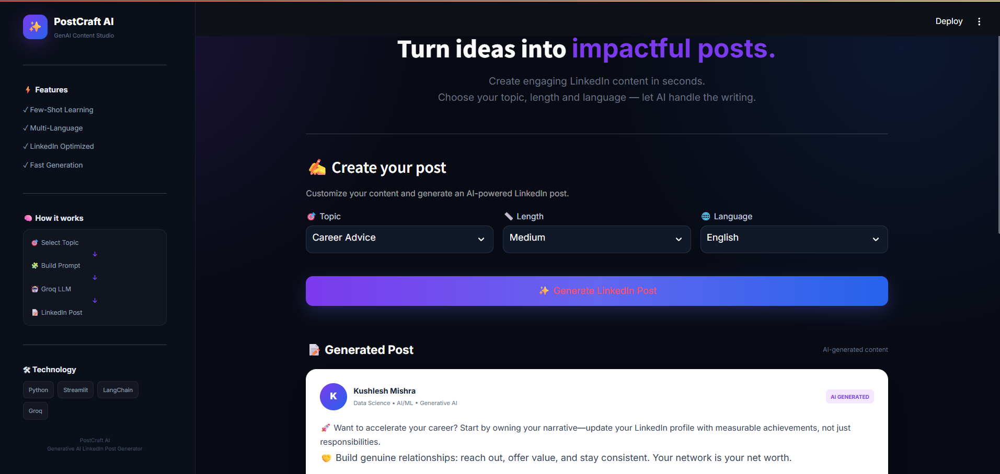
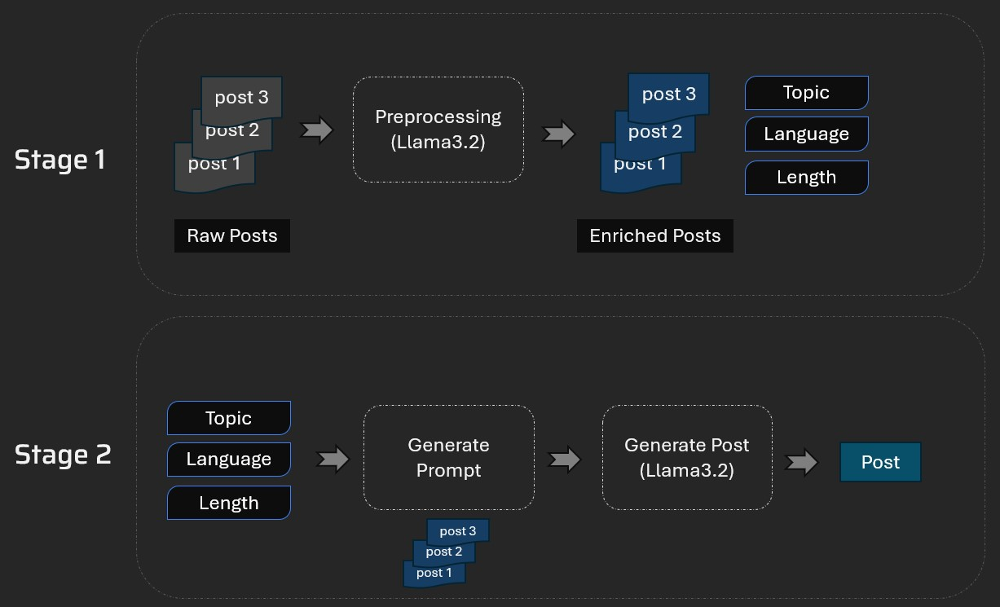

# ✨ PostCraft AI — GenAI LinkedIn Post Generator

**PostCraft AI** is a Generative AI-powered LinkedIn post generator that helps users create engaging, professional LinkedIn content in seconds.

Users can select a **topic, post length, and language**, and PostCraft AI generates a customized LinkedIn post using **Groq LLM + LangChain + Few-Shot Learning**.

🔗 **Live Demo:** Add your Streamlit URL here
🔗 **GitHub:** Add your GitHub repository URL here

---

## 🚀 Features

* ✨ AI-powered LinkedIn post generation
* 🎯 Multiple topic categories
* 📏 Short, Medium, and Long post formats
* 🌐 English and Hinglish language support
* 🧠 Few-Shot Learning for better content generation
* ⚡ Fast inference using Groq LLM
* 📝 LinkedIn-style post preview
* 🎨 Modern AI SaaS-inspired Streamlit UI
* 📋 Easy copy-ready generated content

---

## 🧠 How It Works

```text
User Input
    │
    ▼
🎯 Select Topic
    │
    ▼
📏 Select Length
    │
    ▼
🌐 Select Language
    │
    ▼
🧩 Build Prompt
    │
    ▼
🧠 Few-Shot Examples
    │
    ▼
🤖 Groq LLM
    │
    ▼
📝 Generated LinkedIn Post
```

---

## 🛠️ Tech Stack

| Technology | Purpose                   |
| ---------- | ------------------------- |
| Python     | Core programming          |
| Streamlit  | Web application UI        |
| LangChain  | LLM application framework |
| Groq       | Fast LLM inference        |
| Pandas     | Data processing           |
| JSON       | Post/example data storage |

---

## 📂 Project Structure

```text
project-genai-post-generator/
│
├── assets/
│   └── postcraft_logo.png
│
├── data/
│   ├── processed_posts.json
│   └── raw_posts.json
│
├── resources/
│   ├── architecture.jpg
│   └── tool.jpg
│
├── few_shot.py
├── llm_helper.py
├── main.py
├── post_generator.py
├── preprocess.py
│
├── .gitignore
├── README.md
└── requirements.txt
```

---

## ⚙️ Installation

### 1. Clone the repository

```bash
git clone YOUR_GITHUB_REPOSITORY_URL
```

### 2. Navigate to the project

```bash
cd project-genai-post-generator
```

### 3. Create a virtual environment

```bash
python -m venv venv
```

### 4. Activate the environment

**Windows:**

```bash
venv\Scripts\activate
```

**macOS/Linux:**

```bash
source venv/bin/activate
```

### 5. Install dependencies

```bash
pip install -r requirements.txt
```

---

## 🔑 API Key Setup

PostCraft AI uses the **Groq API** for LLM inference.

Create a `.env` file locally:

```env
GROQ_API_KEY=your_groq_api_key
```

> ⚠️ Never upload your `.env` file or API key to GitHub.

For Streamlit Cloud deployment, add the API key through:

**Streamlit → App Settings → Secrets**

```toml
GROQ_API_KEY = "your_groq_api_key"
```

---

## ▶️ Run Locally

Start the Streamlit application:

```bash
streamlit run main.py
```

The application will open in your browser.

---

## ☁️ Streamlit Deployment

PostCraft AI can be deployed directly from GitHub using Streamlit.

### Deployment Steps

1. Push the project to GitHub.
2. Open Streamlit Cloud.
3. Select **Create App**.
4. Connect your GitHub repository.
5. Select the `main` branch.
6. Set the main file as:

```text
main.py
```

7. Add your Groq API key under **Secrets**.
8. Click **Deploy**.

---

## 🧠 GenAI Concepts Used

### Few-Shot Learning

The application uses existing example posts to guide the LLM toward generating content with a similar structure and style.

### Prompt Engineering

The selected:

* Topic
* Length
* Language
* Few-shot examples

are combined to construct a contextual prompt for the LLM.

### LLM Inference

The generated prompt is sent to a Groq-hosted language model, which produces the final LinkedIn post.

---

## 📸 Application Preview

### 🖥️ PostCraft AI Interface



### 🏗️ System Architecture




## 🎯 Use Cases

PostCraft AI can help users create LinkedIn content around:

* Artificial Intelligence
* Machine Learning
* Data Science
* Generative AI
* Technology
* Career & Jobs
* Programming
* Other professional topics

---

## 🔮 Future Improvements

* 👤 User-specific writing styles
* 💾 Save generated posts
* 📊 Post quality scoring
* #️⃣ Automatic hashtag generation
* 😊 Sentiment and tone control
* 📅 LinkedIn content calendar
* 🧠 RAG-based personalized content generation
* 🔐 User authentication
* 📈 Post analytics

---

## 👨‍💻 Author

**Kushlesh Mishra**

B.Tech CSE — Data Science
Haridwar University, Roorkee

Interested in:

**Data Science • AI/ML • Generative AI • LLM Applications**

---

## ⭐ Support

If you find this project useful, consider giving the repository a ⭐ on GitHub.

---

### 📄 License

This project is intended for educational and portfolio purposes.


